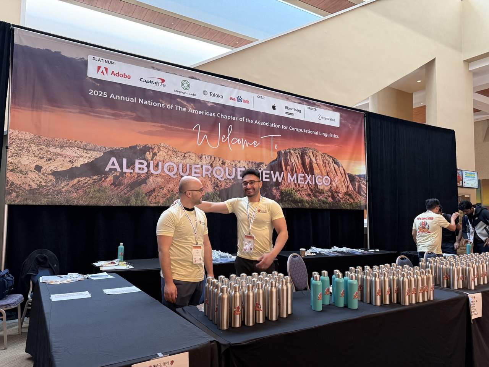

# Aliakbar Nafar

## Summary
PhD in NLP and LLMs with NAACL 2025 Outstanding Paper. 5+ years building production LLM and neuro-symbolic AI models. Open-source project lead with 12+ cross-institution collaborators. Specialty in fine-tuning \& training LLMs, in-context learning \& reasoning.

## Current Projects

- Build an interactive agentic coder with LangGraph, FastAPI, and RAG to generate and debug code to fine-tune collaborative LLMs using reinforcement learning.
- Design an A/B testing framework to evaluate how prompt design influences user trust in AI.

## News
- Serving as a reviewer for COLM 2026. (January, 2026)
- Serving as a reviewer for ACL Rolling Review January cycle. (January, 2026)
- Our paper arXived in ['An Agentic Framework for Neuro-Symbolic Programming'](https://arxiv.org/abs/2601.00743). (January, 2025)
- Serving as a reviewer for the journal of Transactions on Machine Learning Research (TMLR). (October, 2025)
- Serving as a reviewer for ACL Rolling Review October cycle. (October, 2025)
- AAAI 2026 preprint [arXiv](https://arxiv.org/abs/2505.15918) and [GitHub](https://github.com/HLR/llm-bn-parameterization) updated. (August 13, 2025)
- Submitted to AAAI 2026: "Extracting Probabilistic Knowledge from Large Language Models for Bayesian Network Parameterization." (August 1, 2025)
- Invited to serve on the AAAI 2026 Program Committee. (July, 2025)
- Awarded the [Carl V. Page Memorial Graduate Fellowship](https://engineering.msu.edu/about/departments/cse/outreach-and-services). (April, 2025)
- Serving as a reviewer for ACL Rolling Review May cycle. (May, 2025)
- Our paper received the [NAACL 2025 Outstanding Paper Award](https://2025.naacl.org/blog/best-papers/). (April, 2025)
- Selected as a [NAACL 2025 volunteer](https://2025.naacl.org/calls/volunteers/). (April, 2025)  

- "[Learning vs Retrieval: The Role of In-Context Examples in Regression with LLMs](https://aclanthology.org/2025.naacl-long.417/)" accepted to NAACL 2025. (January, 2025)
- "[Reasoning over Uncertain Text by Generative Large Language Models](https://ojs.aaai.org/index.php/AAAI/article/view/34674)" accepted to AAAI 2025. (December, 2024)  
