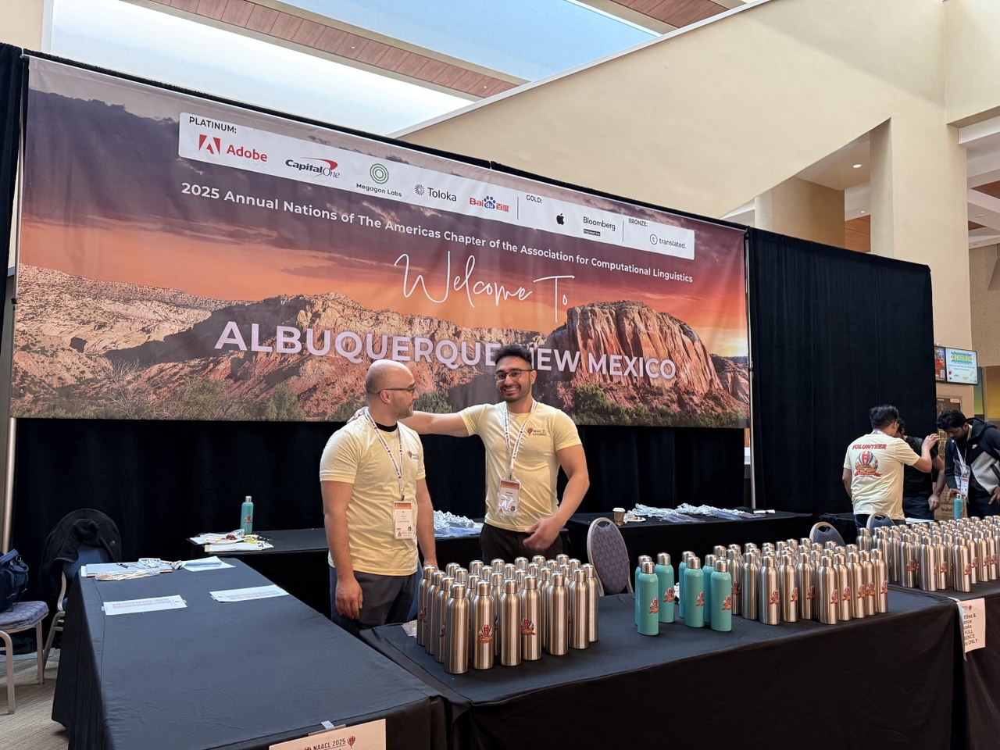

# Aliakbar Nafar

## Summary
PhD in NLP and LLMs with NAACL 2025 Outstanding Paper. 5+ years building production LLM and neuro-symbolic AI models. Open-source project lead with 12+ cross-institution collaborators. Currently an AI Extern at BetterHelp, completing my PhD in the coming months.

## News
- Invited to serve as a reviewer for [AAAI 2027](https://aaai.org/conference/aaai/aaai-27/). (June, 2026)
- Invited to serve as a reviewer for [NeSy 2026](https://2026.nesyconf.org/). (June, 2026)
- Our paper "[Extracting Probabilistic Knowledge from Large Language Models for Bayesian Network Parameterization](https://arxiv.org/abs/2505.15918)" was published in [TMLR](https://jmlr.org/tmlr/). (May, 2026)
- Serving as a reviewer for [ACL Rolling Review](https://aclrollingreview.org/) March cycle. (March, 2026)
- Submitted "[Extracting Probabilistic Knowledge from Large Language Models for Bayesian Network Parameterization](https://arxiv.org/abs/2505.15918)" to [TMLR](https://jmlr.org/tmlr/). (January, 2026)
- Serving as a reviewer for [COLM 2026](https://colmweb.org/). (January, 2026)
- Serving as a reviewer for [ACL Rolling Review](https://aclrollingreview.org/) January cycle. (January, 2026)
- Our paper "[An Agentic Framework for Neuro-Symbolic Programming](https://arxiv.org/abs/2601.00743)" was posted to arXiv. (January, 2026)
- Serving as a reviewer for the journal of [Transactions on Machine Learning Research (TMLR)](https://jmlr.org/tmlr/). (October, 2025)
- Serving as a reviewer for [ACL Rolling Review](https://aclrollingreview.org/) October cycle. (October, 2025)
- Bayesian-network parameterization preprint [arXiv](https://arxiv.org/abs/2505.15918) and [GitHub](https://github.com/HLR/llm-bn-parameterization) updated. (August 13, 2025)
- Invited to serve on the [AAAI 2026](https://aaai.org/conference/aaai/aaai-26/) Program Committee. (July, 2025)
- Awarded the [Carl V. Page Memorial Graduate Fellowship](https://engineering.msu.edu/about/departments/cse/outreach-and-services). (April, 2025)
- Serving as a reviewer for [ACL Rolling Review](https://aclrollingreview.org/) May cycle. (May, 2025)
- Our paper received the [NAACL 2025 Outstanding Paper Award](https://2025.naacl.org/blog/best-papers/). (April, 2025)
- Selected as a [NAACL 2025 volunteer](https://2025.naacl.org/calls/volunteers/). (April, 2025)  

- "[Learning vs Retrieval: The Role of In-Context Examples in Regression with LLMs](https://aclanthology.org/2025.naacl-long.417/)" accepted to NAACL 2025. (January, 2025)
- "[Reasoning over Uncertain Text by Generative Large Language Models](https://ojs.aaai.org/index.php/AAAI/article/view/34674)" accepted to AAAI 2025. (December, 2024)  
